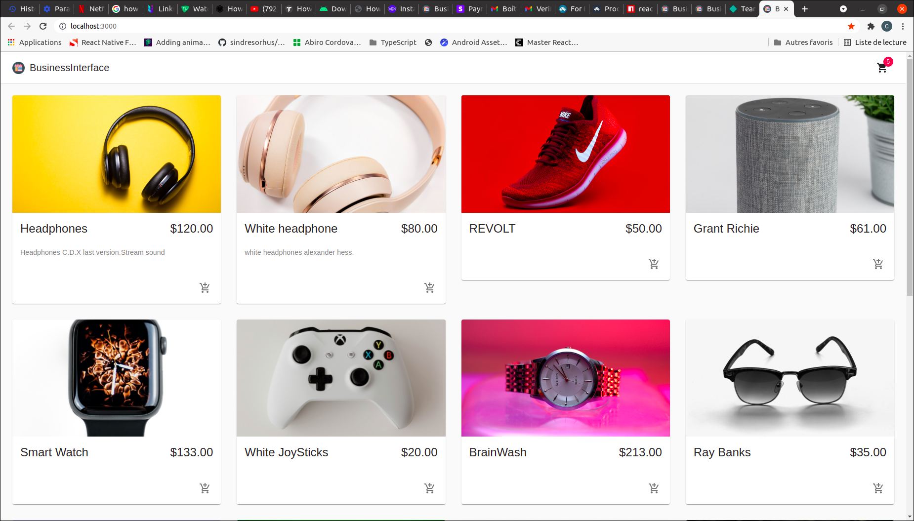
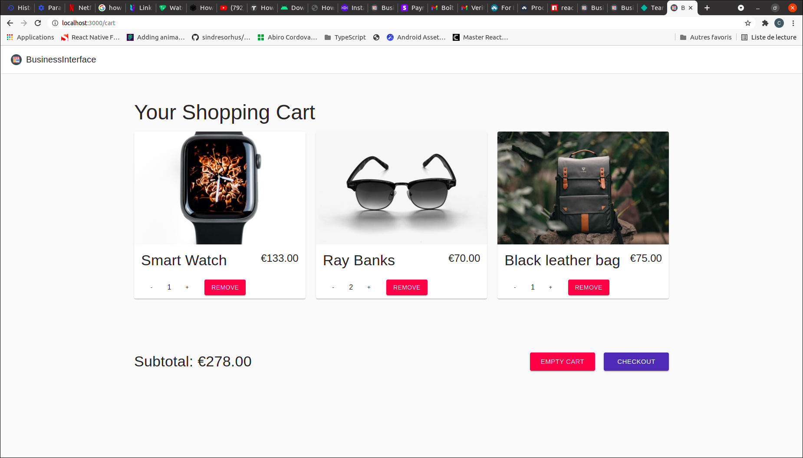
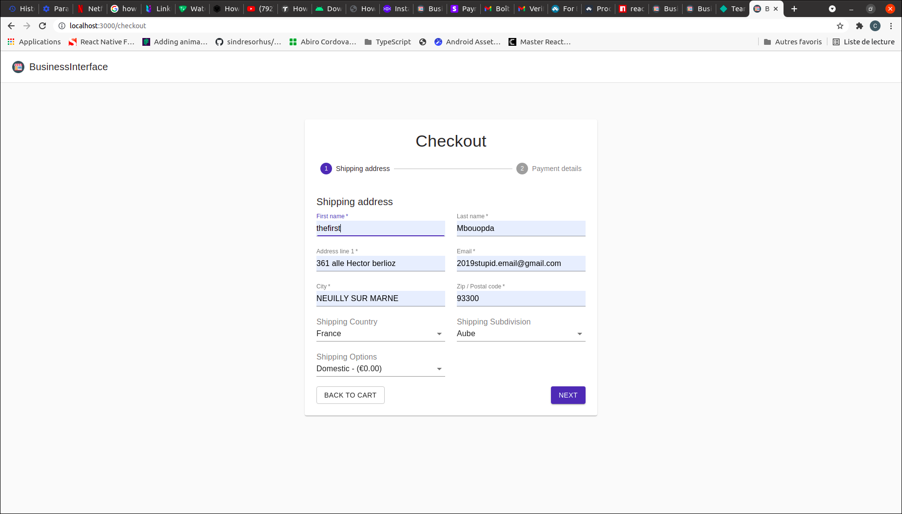
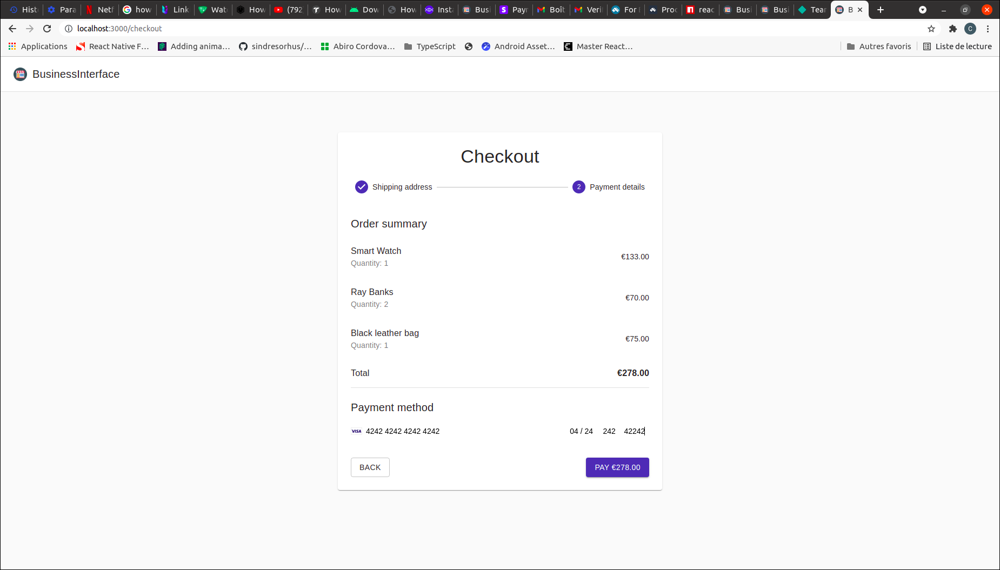

    

        

         
        
    
    
    

  

# BusinessInterface (Reactjs)

    

        

              
              
              
                
        
    
    
    

  

Business interface is a fully functional online shop built with reactjs and Commerce.js where you can actually sell your products, with stripe payment integrated.

## Features

- Home
- Cart
- Address details
- Payment details

# Installation

1. Simply clone the project from this project. After cloning the repository, You would need to get your own API KEYS for stripe and Commerce.js else you can use the .env.example file.

# Setting up the sample app

- Open the project.

- Run `cd business_interface`.

- Hit `npm i`  to install the packages.

- Run `npm start` 

Build and run the Sample App, Happy Coding.